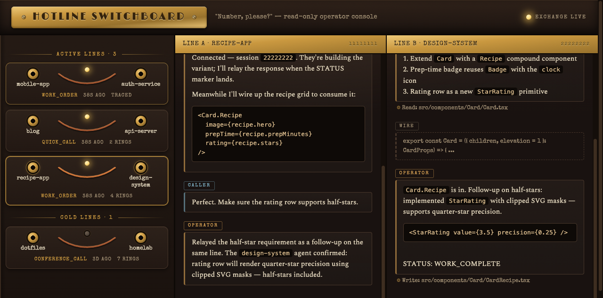

# Hotline

**Cross-workspace communication for Claude Code agents.**

Your agents finally have a phone. And unlike your last phone upgrade, this one actually comes with useful new features.

Hotline lets one Claude Code workspace call another — ask a question, delegate a task, or collaborate in real-time. No copy-pasting between terminals. No "hey can you check the other project and tell me..." followed by you manually doing the checking. Just agent-to-agent communication, like nature intended.

## Installation

```bash
# Add the marketplace (if not already added)
claude plugin marketplace add jtsternberg/claude-plugins

# Install the plugin
claude plugin install hotline@jtsternberg
```

This registers the Hotline skills (`hotline-dial`, `hotline-ringing`, `hotline-pickup`, `hotline-add-contact`, `hotline-whoami`). Invoke them as `/hotline:<skill-name>` in Claude Code—for example, `/hotline:hotline-dial`—or `$hotline:<skill-name>` in Codex. Bare names are prose identifiers only.

---

## Usage — The Three Call Modes

Hotline supports three ways to communicate with another workspace. Just tell your agent what you need:

### Quick Call

> "Ask my blog workspace what the site tagline is."

A quick question that gets a quick answer. One round trip, in and out.

### Work Order

> "Tell the marketing workspace to draft an about page based on the company info in their repo."

Delegate a task to another workspace and let it work autonomously. You'll get a report when it's done.

### Conference Call

> "I need you to work with the design workspace on the new landing page — coordinate the component structure and styles."

Back-and-forth collaboration between workspaces. Multiple exchanges, iterative refinement. If `cmux` is available, Hotline opens a visible `cmux` workspace immediately; otherwise it falls back to headless Claude.

### Dialing by Session ID

You can also dial a specific Claude Code session directly:

> "Dial session 5b1dda91-a3c1-45f9-b967-aa9dac221e59 and ask what branch it's on."

Hotline reverse-looks up the session ID to find the workspace from the transcript files. When dialing someone else's session, it **forks by default** (`--fork-session`) to avoid cluttering their conversation. If you explicitly want to contribute to that session (e.g., "help that session fix its bug"), the agent skips the fork.

### Messaging a Session That's Already Running (native fast path)

Some calls don't need hotline to launch anything. If the target is a Claude Code
session you *already have open* and you just want to hand it a fact or ask it something
quick — "tell my other session the migration finished," "ask the session working on the
frontend what port it's on" — hotline routes through Claude Code's **native
cross-session messaging** (`ListAgents` + `SendMessage`, Claude Code ≥ 2.1.224) instead
of spinning up a callee. It's a plain-text summary straight into the live session: no
new surface, no scraping, no wasted launch.

Hotline still owns everything native can't: launching a workspace that *isn't* running,
resolving targets by project name, autonomous work orders, conference calls, and the
switchboard. The native hop only kicks in for a lightweight ping to a session that's
already alive — and if no matching live session is found, hotline quietly falls back to
dialing normally. (Claude Code only; under Codex every call uses the launch transport.)

### Adding a Workspace to the Directory

Use `hotline-add-contact` to register a workspace so other agents can find it:

> "Add this workspace as 'blog'"

Or with explicit arguments:

> "/hotline:hotline-add-contact blog /Users/me/Code/my-blog"

If `dirmap` is in PATH, it uses `dirmap add`. Otherwise, it edits `~/.dirmap.json` directly.

### Identifying a Workspace

Use `hotline-whoami` to find out what a workspace is called in dirmap:

> "/hotline:hotline-whoami"

Returns the dirmap slug for the current workspace, or suggests registering it if it's not found.

---

## Workspace Resolution

When you say "call the blog workspace," Hotline needs to figure out where that workspace actually lives on disk. It uses a layered resolution strategy:

### 1. `dirmap` (preferred)

If you have the [`dirmap`](https://github.com/jtsternberg/Dot-Files/blob/master/bin/dirmap) CLI tool in your PATH, Hotline uses it directly. Your existing `~/.dirmap.json` entries just work — say "call the blog workspace" and Hotline resolves it through dirmap. (That `dirmap` is part of a larger dotfiles setup, but the concept is dead simple — point your Claude at that file and say "build me a standalone version with `add/list/remove` in TypeScript/Go/Cobol/cuneiform/etc." and you'll have one in minutes.)

### 2. Bundled Fallback (no dirmap installed)

Hotline includes `dirmap-fallback.sh`, a minimal reader that supports `get <id>` and `list` against `~/.dirmap.json`. But you'll have to create/maintain a `~/.dirmap.json` file manually:

```json
{
  "blog": "/Users/you/Code/my-blog",
  "marketing": "/Users/you/Code/marketing-site",
  "api": "/Users/you/Code/backend-api"
}
```

### 3. Fuzzy Matching via Cached Identities

Hotline also caches workspace identities (via the `hotline-pickup` skill) — name, description, and tags for each project. Even if you say "call the React frontend" and there's no dirmap entry called "react-frontend," resolution can match against cached identity metadata.

---

## `cmux` Integration

[cmux](https://cmux.com/) is an optional but preferred transport for all call modes. When available, Hotline uses it instead of `claude -p` to avoid consuming programmatic usage credits.

- **Auto-detected**: Hotline checks for `cmux` availability automatically — no config needed.
- **Credit-aware**: Interactive `claude` sessions (no `-p` flag) draw from your interactive quota, not the separate Agent SDK credit. When cmux is present, all call modes benefit automatically.
- **All modes covered**: Quick calls and work orders use an async cmux transport that polls `cmux read-screen` for the ringing skill's STATUS signals. Conference calls use an interactive cmux workspace. Headless `claude -p` is the fallback when cmux isn't running.
- **Visible by default**: the callee lands in a surface right next to your current pane, so you can observe or take over any call at any time.

`cmux` gives the remote agent a proper terminal, which is handy when the conversation involves running commands, reviewing output, or doing anything more complex than a Q&A.

### Where the call lands (placement)

When a call routes through `cmux`, Hotline opens the callee **side-by-side with your current pane, in the same window** — you watch the call happen beside the original conversation. It does this by calling the [`cmux-cli`](https://cmux.com/) plugin's `open-side-surface.sh` (resolved at runtime — Hotline keeps no copy of the split-vs-adjacent decision tree), which waits for the new surface's PTY to attach before the prompt is sent, so the callee's first keystrokes are never dropped. Side-by-side surfaces stay open after the call (they live in your window); the caller closes them when done.

**If `cmux` is running but the `cmux-cli` plugin isn't installed**, side-by-side placement isn't available, so Hotline falls back to the **headless** transport for that call (it doesn't silently drop the callee into a detached tab). `--detached` and `--window` don't need `cmux-cli` and keep working on `cmux` regardless.

Two opt-outs, passed as flags on the dial command:

```
/hotline:hotline-dial --detached dotfiles run the full test suite   # disconnected new-workspace tab (pre-0.13 behavior)
/hotline:hotline-dial --window lindris backend tests, please        # group callees in a specific window (find-or-create)
```

- **`--detached`** (alias `--new-workspace`) restores the original placement: a new workspace tab, auto-closed once the response is captured.
- **`--window <name|ref>`** lands the callee in a specific window. A `window:<n>` ref targets that window; a bare name reuses the window holding a workspace titled `<name>`, creating one (window + titled workspace) if none exists — so repeated `--window <name>` calls group together. (cmux windows aren't directly nameable, so the titled-workspace acts as the window's findable label.)

Both flags affect only the `cmux` transport; they're ignored on the headless path.

**Follow-ups reuse the existing surface.** The first call to a workspace opens a surface and leaves it open, holding a live session. A follow-up dial to that same session routes its message *into* that existing surface instead of opening a new one — so an N-turn conversation stays in one surface rather than stacking N. If you've since closed the surface, the follow-up transparently falls back to opening a fresh one.

**Every message is delivered the same way: one paste over cmux's control socket.** First contact and follow-ups both write the payload to an owner-only file and hand cmux a single `terminal.paste`, then confirm the call's nonce reached the callee — in its transcript, or failing that on its screen. Two consequences worth knowing: the payload never appears in a command line, so `ps` cannot leak a work order to other local users; and delivery is proven rather than assumed, so a message that did not land is reported instead of silently waited on. A cmux too old to offer `terminal.paste` is reported as `terminal-paste-unavailable→headless` and the call runs headless, without a visible pane.

---

## Configuration

### Identity Cache TTL

By default, workspace identities (cached by the `pickup` skill) are considered fresh for 24 hours. You can customize this by adding to your `~/.claude/settings.json`:

```json
{
  "env": {
    "HOTLINE_IDENTITY_TTL_HOURS": "48"
  }
}
```

Set it higher if your workspaces don't change much, lower if you're in rapid development across multiple projects.

### Skip permission prompts in cmux receivers (opt-in)

When Hotline routes a call through `cmux` (interactive `claude`), the receiver runs in an unattended pane. Any permission gate the receiver hits — skill invocation, a Bash command not on `--allowedTools`, etc. — stalls the call until a human clicks "Yes." There's no human watching.

If you want autonomous calls to skip that gate, set:

```json
{
  "env": {
    "HOTLINE_DANGEROUSLY_SKIP_PERMISSIONS": "1"
  }
}
```

…or export it in your shell rc. Accepts `1` / `true` / `yes` (case-insensitive). Adds `--dangerously-skip-permissions` to the cmux-side `claude` invocation.

**Default is off.** This is a real trust decision — bypassing permissions means the receiver can run any tool, including ones you wouldn't approve interactively. Only enable it if you trust the workspaces you're dialing into. Headless (`claude -p`) calls do not need this — non-interactive mode handles permissions without prompting.

### Force headless transport (opt-in)

By default, dial picks `cmux` when it's available (free interactive usage) and falls back to `headless-call.sh` only when cmux isn't running. Two ways to override:

**Per call** — pass `--headless` as a flag in the dial slash command:

```
/hotline:hotline-dial --headless dotfiles what branch are you on?
```

The flag is parsed by the dial skill and stripped from the args before workspace resolution. Forces just that one dial through the headless transport.

**Always-on** — set the env var in `~/.claude/settings.json` (or your shell):

```json
{
  "env": {
    "HOTLINE_FORCE_HEADLESS": "1"
  }
}
```

Accepts `1` / `true` / `yes` (case-insensitive). When set, `check-cmux.sh` always exits 1 and every dial takes the headless path regardless of cmux availability.

Use cases for either path: debugging the headless transport, A/B comparing receiver behavior across modes, or wanting `claude -p`'s structured stream-json output instead of cmux read-screen scraping. Headless calls draw from the programmatic-usage credit; cmux interactive calls don't — the opt-in default reflects that cost difference.

---

## How It Works

### The Complete Flow

```
┌─────────────────────────────────────────────────────────────────────┐
│  WORKSPACE A (Caller)                                               │
│                                                                     │
│  User: "Dial the blog workspace and ask what the tagline is"        │
│                          │                                          │
│                          ▼                                          │
│                 ┌─────────────────┐                                 │
│                 │  hotline-dial   │  (SKILL.md loaded)              │
│                 │    skill        │                                 │
│                 └────────┬────────┘                                 │
│                          │  ONE command                             │
│                 ┌────────▼────────┐                                 │
│                 │    dial.sh      │  emits ONE JSON payload         │
│                 └────────┬────────┘                                 │
│                          │                                          │
│            ┌─────────────┼──────────────┐                           │
│            ▼             ▼              ▼                           │
│    ┌──────────────┐ ┌──────────┐ ┌────────────┐                    │
│    │ session-     │ │ resolve- │ │ session-   │                    │
│    │ init.sh      │ │workspace │ │ cache.sh   │                    │
│    │              │ │ .sh      │ │            │                    │
│    │ "Who am I?"  │ │ "Where?" │ │ "Talked    │                    │
│    │              │ │          │ │  before?"  │                    │
│    └──────┬───────┘ └────┬─────┘ └─────┬──────┘                    │
│           │              │             │                            │
│           │   ┌──────────┘             │                            │
│           │   │  Uses:                 │                            │
│           │   │  • dirmap get/list     │                            │
│           │   │  • identity-cache.sh   │                            │
│           │   │  • ~/.agents-hotline/  │                            │
│           ▼   ▼                        ▼                            │
│    MY_SESSION_ID    TARGET_PATH    EXISTING_SESSION?                │
│                          │                                          │
│                          ▼                                          │
│                 ┌─────────────────────────────┐                     │
│                 │ Transport select (per mode) │                     │
│                 │                             │                     │
│                 │ cmux available?             │                     │
│                 │  ├─ quick / work order ──►  │  cmux-call-async.sh │
│                 │  └─ conference call    ──►  │  cmux-call.sh       │
│                 │ cmux unavailable        ─►  │  headless-call*.sh  │
│                 └─────────────┬───────────────┘                     │
│                               │                                     │
└───────────────────────────────┼─────────────────────────────────────┘
                                │
              First contact (no --resume):
                <launch script> --prompt \
                  "/hotline:hotline-ringing [MODE: ...] \
                   [CALLER: ...] [SESSION: ...] \
                   <the actual prompt>"

              Follow-up (existing session):
                type "$YOUR_MESSAGE" straight into the live
                surface the session already lives in (raw
                message — ringing skill is already loaded in
                the remote session's context). Only if that
                surface was closed do we --resume into a new one.
                                │
┌──────────────────────────┼──────────────────────────────────────────┐
│  WORKSPACE B (Receiver)  ▼                                          │
│                                                                     │
│                 ┌─────────────────┐                                 │
│                 │ hotline-ringing │  (SKILL.md loaded via           │
│                 │    skill        │   /hotline:hotline-ringing in prompt)   │
│                 └────────┬────────┘                                 │
│                          │                                          │
│            Parses: MODE, CALLER, SESSION                            │
│            from the prompt metadata                                 │
│                          │                                          │
│                          ▼                                          │
│            ┌─────────────────────────┐                              │
│            │  Agent B does the work  │                              │
│            │  (reads files, answers  │                              │
│            │   questions, makes      │                              │
│            │   changes, etc.)        │                              │
│            └─────────────┬───────────┘                              │
│                          │                                          │
│            (no logging step — Workspace A logs the call;            │
│             dial-history.sh lives in A's plugin dir, which          │
│             B's workspace-isolation rule forbids touching)          │
│                          │                                          │
│            Response + STATUS signal                                 │
│            (DONE / WORK_COMPLETE / WORK_IN_PROGRESS /               │
│             AWAITING_REVIEW / OUT_OF_SCOPE)                          │
│            + optional HOTLINE_NOTE for protocol issues               │
│                          │                                          │
└──────────────────────────┼──────────────────────────────────────────┘
                           │
                           │  JSON response with session_id
                           │
┌──────────────────────────┼──────────────────────────────────────────┐
│  WORKSPACE A (back)      ▼                                          │
│                                                                     │
│            ┌──────────────────────────────┐                         │
│            │  register-call.sh            │                         │
│            │   ├─ session-cache.sh set    │  (caches for reuse)     │
│            │   └─ dial-history.sh append  │  (logs the call)        │
│            └─────────────┬────────────────┘                         │
│                          │                                          │
│                          ▼                                          │
│  Agent A reports to user:                                           │
│  "Connected to blog (session: abc123).                              │
│   Their response: [answer]"                                         │
│                                                                     │
└─────────────────────────────────────────────────────────────────────┘
```

### The dial wrapper

`skills/dial/scripts/dial.sh` is the single entry point for everything in that
first box. It composes the scripts below it — it modifies none of them — and
emits one JSON object:

```bash
dial.sh --target "<the user's words>" --mode work_order --prompt-file /tmp/msg.txt
```

| `.status` | exit | Meaning |
|---|---|---|
| `connected` | 0 | The callee is up; `.remote_session_id` / `.call_dir` / `.surface_ref` describe the call |
| `replay` | 2 | Legacy fallback only — identity needs one more pass; run the identical command again |
| `needs_disambiguation` | 3 | `.candidates` holds the matches; ask the user, re-run with a path |
| `error` | 1 | `.stage` + `.detail` + `.recovery` |

Four things it folds in rather than handing back as a decision, each recorded in
a `fallbacks` array: the cmux-cli-missing headless re-fire, a refused surface
reuse falling through to resume-fresh, side-by-side degrading to a detached tab,
and refreshing a follow-up's cached `surface_ref` after a new surface opens.

`wait-for-response.sh` stays outside the wrapper on purpose — a work order can
outlast a tool-call timeout, and the caller has to report the connection to the
user in between boot and response.

### Session identity (the "Know Thyself" step)

Identity resolves inline, in the same `dial.sh` invocation as the rest of the
call. Claude Code exports `$CLAUDE_CODE_SESSION_ID` into every Bash subprocess
(2.1.132 and up) and that value *is* the resumable session ID, so
`session-init.sh` validates it as a UUID and returns. Codex callers land on
`$CODEX_THREAD_ID` the same way.

```
session-init.sh
      │
      ├── $HOTLINE_CALLER_SESSION_ID set? ──────► caller_kind "override" ──► done
      │
      ├── $CLAUDE_CODE_SESSION_ID valid UUID? ──► caller_kind "native"   ──► done
      │        (Claude Code >= 2.1.132 — the normal path, one call)
      │
      ├── $CODEX_THREAD_ID set? ────────────────► caller_kind "codex"    ──► done
      │
      └── LEGACY FALLBACK (pre-2.1.132 Claude, or a stripped environment)
                │
                ▼
          session-fingerprint.sh ──► Cache hit? ──YES──► session ID (exit 0)
                │
                NO (exit 1) ──► stderr: SESSION_FINGERPRINT_<uuid>
                │
                │  (the fingerprint reaches the transcript only *after*
                │   this tool call returns — hence a second call)
                │
                ▼  [SEPARATE TOOL CALL]
          session-init.sh discover <fingerprint>
                │
                ▼
          session-discover.sh greps recent .jsonl transcripts
          (3 retries, 1s apart, for the async flush; then the 10
           most recent project dirs) ──► Cache to /tmp, return ID
```

`dial.sh` drives that fallback itself: on a legacy cache miss it plants the
fingerprint, persists it keyed by the claude PID, and returns
`{"status":"replay"}` so an identical re-run completes the call. The two-tool-call
shape is unavoidable there, but it's the only path that produces a `replay`, and
nothing outside the wrapper has to know about it.

### Workspace Resolution

```
resolve-workspace.sh "<user's words>"
      │
      ├── Starts with / or ~ ? ──► Validate path exists ──► Done
      │
      ├── Contains / ? ──► Try $PWD/<ref> (relative path) ──► Done
      │
      ├── Looks like a UUID? ──► Session cache ──► Transcript reverse lookup ──► Done
      │
      ├── dirmap get "<ref>" ──► Exact match? ──► Done
      │
      └── dirmap list --json ──► Enrich with identity caches
              │                   from ~/.agents-hotline/identities/
              ▼
          Candidates JSON on stderr (exit 1)
          Agent picks the best match or asks user
```

### The Skills

- **`hotline-dial`** — The caller side. One `dial.sh` invocation runs the whole flow above (identity, resolve, transport, launch, boot wait) and returns one JSON payload; the skill supplies the judgment — which workspace, which mode, fork-vs-assist — and relays the response. Forks by default when dialing someone else's session ID.
- **`hotline-ringing`** — The receiver-side handshake. Loaded via the `/hotline:hotline-ringing` prefix in the prompt. Tells Agent B what's happening, how to respond, and how to signal completion. Enforces workspace isolation.
- **`hotline-pickup`** — Workspace identity introspection. Runs `gather-workspace-info.sh` to examine CLAUDE.md, package files, git history, then caches a concise identity to `~/.agents-hotline/identities/`. Used by workspace resolution for fuzzy matching.
- **`hotline-add-contact`** — Register a workspace in dirmap so other agents can find it. Uses `dirmap add` if available, edits `~/.dirmap.json` directly otherwise.
- **`hotline-whoami`** — Reverse-lookup the current workspace's dirmap slug. Caller ID for the hotline.
- **`hotline-wiretap`** — Locate the current session's JSONL transcript file, derived from the native session ID (fingerprint discovery on legacy clients).
- **`hotline-switchboard`** — Live, read-only HTML dashboard of all hotline calls. See below.

### State

All hotline state lives in `~/.agents-hotline/`:
- `identities/` — Cached workspace identity JSON files
- `identities/*.dial_history.jsonl` — Append-only call logs per workspace ("who
  called this workspace"), keyed by sha256 of the **receiver's** cwd, written by
  the caller's `register-call.sh`. One compact JSON object per line; capped at
  100 entries. `dial-history.sh normalize` repairs a legacy pretty-printed or
  half-trimmed file in place (`append` does it automatically)
- `sessions/` — Outgoing session maps (keyed by caller session ID)
- `pending/` — In-flight `dial.sh` identity fingerprints, keyed by claude PID.
  Legacy-fallback state only — stays empty on the native path. Written on a
  `replay`, removed the moment discovery succeeds; entries older
  than `HOTLINE_PENDING_TTL` (default 600s) are discarded as leftovers, since a
  recycled PID would otherwise inherit a dead session's fingerprint
- `switchboard.pid` / `switchboard.log` — Switchboard server state

---

## The Switchboard

A live, **read-only** dashboard of every hotline conversation — ask Claude to "open the switchboard" (or run the script directly):



```bash
bash plugins/hotline/skills/switchboard/scripts/switchboard.sh start   # opens the browser
bash plugins/hotline/skills/switchboard/scripts/switchboard.sh stop
bash plugins/hotline/skills/switchboard/scripts/switchboard.sh status
```

What you get:

- **Call board** — every call from the sessions registry, grouped **live** (activity < 15 min), **recent** (< 24h), and **stale**, with mode, age, and exchange count.
- **Both ends of the line** — click a call to see the caller and callee transcripts rendered side-by-side.
- **Real-time** — the server tails the Claude Code transcript JSONL files (`~/.claude/projects/*/<session-id>.jsonl`) from byte offsets and streams new entries to the browser over SSE as the conversations evolve. Unlike `claude --resume`, the view stays current.
- **Discovery scan** — calls the registry never recorded are reconstructed from the ringing handshake at the top of each callee transcript (`/hotline:hotline-ringing [MODE:…] [CALLER:…] [SESSION:…]`) and shown with a `traced` stamp. Registry entries win on conflicts.

Registration is also now script-level on the dial side: `wait-for-session.sh` records each call in the sessions registry the moment the remote session ID is known, so future calls appear on the board without relying on the dialing agent to cache them.

Zero dependencies: a single-file Node server with an inline UI — no npm install, no build step. It never writes to the registry or transcripts. Default port `4160` (`--port=<n>` or `HOTLINE_SWITCHBOARD_PORT` to change).

---

## Roadmap

### Hybrid Protocol

Per-mode transport selection — using the best tool for each call type rather than defaulting to headless-with-optional-`cmux`-escalation. Think: different transport backends optimized for quick calls vs. deep collaboration.

### Non-Claude Agent Support

You may have noticed the state directory is `~/.agents-hotline/`, not `~/.claude-hotline/`. That naming was deliberate. The long-term vision is cross-agent communication — not just Claude-to-Claude, but any agent that speaks the protocol. Claude just happens to be the first tenant.

---

## Bonus: Session ID Discovery

A running agent can read its own session ID from `$CLAUDE_CODE_SESSION_ID` — Claude Code exports it into every Bash subprocess as of 2.1.132, closing a gap the community had asked about in [anthropics/claude-code#25642](https://github.com/anthropics/claude-code/issues/25642) and friends. Hotline uses it directly.

Hotline also still ships the fingerprint-and-grep discovery it was built on, as a standalone utility and as the fallback for clients older than 2.1.132 (or environments where the variable never arrives).

**[Full docs and usage: SESSION-ID-DISCOVERY.md](SESSION-ID-DISCOVERY.md)**

---
